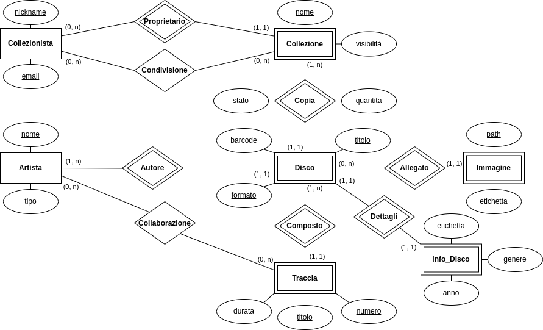

# Laboratorio di Basi di Dati: *Progetto "Collectors"*

**Gruppo di lavoro**:

| Matricola | Nome  |             Cognome             | Contributo al progetto |
|:---------:|:-----:|:-------------------------------:|:----------------------:|
|  271744   | Marco |             Ciucci              |         Totale         | 

**Data di consegna del progetto**: 13/06/2023

## Analisi dei requisiti

- Registrazione di dati relativi ai collezionisti e alle loro collezioni di dischi (ogni collezionista può creare più collezioni). 
- Per ogni disco in una collezione, dovranno essere specificati gli autori, il titolo, l'anno di uscita, l'etichetta discografica, il genere musicale, lo stato di conservazione (scelto da una lista predefinita), il formato, il barcode, se disponibile.
- Lista delle tracce, ciascuna con titolo, durata, compositore ed esecutore, se diverso da quelli dell'intero disco. 
- Ogni disco può essere associato a una o più immagini (copertina, retro, eventuali facciate interne o libretti, ecc.).
- Per ogni disco, il collezionista potrà inoltre indicare l'eventuale numero di doppioni a sua disposizione.
- I collezionisti possono decidere di condividere la propria collezione con specifici utenti o in maniera pubblica.

### Scelte progettuali e disambiguazione

- Un collezionista può aggiungere più doppioni dello stesso disco solo se hanno stesso stato di conservazione.
- Un disco ha un solo autore. Possono però essere specificati ulteriori contributori (artisti).
- Un artista è autore solo in relazione ai propri dischi.
- I gruppi musicali sono un artista unico.
- Si individuano tre sotto-entità di artista: esecutore (cantante), compositore (musicista) e gruppo musicale. Anche un compositore può essere autore di un disco.
- Lo stato di conservazione non è applicabile al formato digitale.
- Talvolta il concetto di doppione sarà definito con il termine "copia"
- Talvolta il concetto di collaborazione sarà definito con il termine "featuring"

## Progettazione concettuale


- Nota: un disco con un determinato formato e riferito a una certa collezione è unico: un disco identico ma con un formato differente o riferito a una collezione differente rappresenta un'ulteriore istanza di *Disco*. 
	- La scelta relativa al formato deriva dal fatto che spesso uno stesso disco in formati differenti ha caratteristiche diverse, ad esempio le immagini presenti all'interno possono variare dal formato CD a quello vinile, oppure non sono proprio presenti come in quello digitale. Inoltre spesso formati differenti hanno barcode differenti.
	- La scelta relativa alla collezione di riferimento è dovuta a fattori di "protezione" del dato, ossia per impedire che la modifica di un'informazione di un disco da parte di un collezionista si ripercuota sulle collezioni degli altri collezionisti.
- Come già accennato, è possibile inserire più copie di uno stesso disco con formati diversi. Si possono inoltre inserire doppioni di uno stesso disco con lo stesso stato di conservazione.
- La visibilità di una collezione è espressa sia tramite il relativo attributo, sia tramite la relazione *Condivisione*, che permette di condividere la collezione solo con specifici collezionisti.
- Un artista può essere autore di un disco, ma può anche collaborare a tracce di altri artisti, tramite la relazione *Collaborazione*.
- È stato aggiunto l'attributo numero di traccia, che insieme a titolo costituisce la chiave primaria di *Traccia*. Questo perché spesso vengono rilasciati dischi in due parti separate, in cui la seconda parte segue la numerazione della prima.
- Sebbene alcuni dischi possano avere tracce in comune (es. edizioni deluxe), una traccia è riferita a un solo disco, per evitare che la rimozione di una traccia da un disco comporti la rimozione anche dagli altri dischi.
- Oltre ai tipi di artista "Esecutore" e "Compositore", si è individuato il tipo "Gruppo", in quanto molto spesso questi sono esecutori e compositori della loro musica
- Entità deboli
  - **Collezione**: possono esserci più collezioni con uno stesso nome ma appartenenti a collezionisti diversi
  - **Disco**: possono esserci più dischi con uno stesso titolo, inoltre deve essere sempre riferito a una collezione
  - **Traccia**: possono esserci più tracce con uno stesso titolo

### Formalizzazione dei vincoli non esprimibili nel modello ER

- Il barcode contraddistingue univocamente un disco da un altro, tuttavia non è possibile identificarlo come chiave primaria dell'entità, in quanto non sempre presente.

## Progettazione logica

### Ristrutturazione e ottimizzazione del modello ER



- Per la generalizzazione dell'artista (Esecutore/Compositore/Gruppo) è stata effettuata una *fusione figli-genitore*, in quanto nel database queste entità non vengono mai trattate separatamente, si è quindi introdotto l'attributo discriminante *Tipo*.
- Per alleggerire l'entità *Disco*, sono state introdotte le entità
	- *Info_disco*, che contiene tutti gli attributi secondari
	- *Immagine*, che deriva dalla decomposizione dell'attributo multi valore omonimo, nella quale è possibile specificare il path e l'etichetta di un'immagine

### Traduzione del modello ER nel modello relazionale

* **Collezionista** (**<ins>ID</ins>**, nickname, email) <br>
* **Collezione** (**<ins>ID</ins>**, <ins>ID_collezionista</ins>, nome, visibilità) <br>
* **Condivisione** (<ins>ID_collezionista</ins>, <ins>ID_collezione</ins>) <br>
* **Artista** (**<ins>ID</ins>**, nome, tipo) <br>
* **Disco** (**<ins>ID</ins>**, <ins>ID_collezione</ins>, <ins>ID_autore</ins>, titolo, formato, barcode, stato, quantità) <br>
* **Immagine** (**<ins>ID</ins>**, <ins>ID_disco</ins>, path, etichetta) <br>
* **Info_Disco** (<ins>ID_disco</ins>, genere, etichetta, anno) <br>
* **Traccia** (**<ins>ID</ins>**, <ins>ID_disco</ins>, numero, titolo, durata) <br>
* **Collaborazione** (<ins>ID_artista</ins>, <ins>ID_traccia</ins>)

|      Attributo       |   Significato   |
|:--------------------:|:---------------:|
|  **<ins>ID</ins>**   | Chiave primaria | 
| <ins>ID_entità</ins> | Chiave esterna  |

## Progettazione fisica

### Implementazione del modello relazionale

- Per la creazione e il popolamento del database, utilizzare gli script [struttura](src/collectors_struttura.sql) e [dati](src/collectors_dati.sql).
- Alternativamente si può utilizzare il [file di dump](src/dump/collectors_dump.sql), il quale contiene tutti i dati e tutte le viste, funzioni e procedure utilizzate in seguito.
- Tutti gli script utilizzati sono inoltre presenti nella [directory src](src/).

### Implementazione funzionalità richieste

La maggior parte delle funzionalità richieste sono implementate mediante funzioni o stored procedures.
#### Funzionalità 1

> Inserimento di una nuova collezione.

[Funzione](src/functions_and_procedures/aggiungi_collezione.sql) per la creazione di una collezione.
```sql
DROP FUNCTION IF EXISTS aggiungi_collezione;
DELIMITER $
CREATE FUNCTION aggiungi_collezione (ID_collezionista INTEGER UNSIGNED, nome VARCHAR(50), visibilita VARCHAR(10))
RETURNS INTEGER UNSIGNED DETERMINISTIC
BEGIN
	INSERT INTO collezione (ID_collezionista, nome, visibilita) 
    VALUES (ID_collezionista, nome, visibilita);
	
    RETURN last_insert_id();
END$
DELIMITER ;
```
[Query](src/queries/Query_1.sql) di esempio.
```sql
SELECT AGGIUNGI_COLLEZIONE(3, 'Collezione Hip-Hop', 'Privata');
```

#### Funzionalità 2

> Aggiunta di dischi a una collezione e di tracce a un disco.

[Funzione](src/functions_and_procedures/aggiungi_disco.sql) per la creazione di un disco e inserimento nella collezione (aggiunta di una copia).
La funzione inoltre verifica che se il formato del disco inserito è digitale, allora lo stato di conservazione deve essere impostato su n/a (non applicabile).
```sql
DROP FUNCTION IF EXISTS aggiungi_disco;
DELIMITER $
CREATE FUNCTION aggiungi_disco (
	ID_collezione INTEGER UNSIGNED, quantita SMALLINT UNSIGNED, stato VARCHAR(50), 
    ID_autore INTEGER UNSIGNED, titolo VARCHAR(50), formato VARCHAR(20), 
    barcode VARCHAR(12), genere VARCHAR(50), etichetta VARCHAR(50), anno SMALLINT UNSIGNED)

RETURNS INTEGER UNSIGNED DETERMINISTIC 
BEGIN
    DECLARE IDdisco INTEGER UNSIGNED;

	IF (formato = 'Digitale') THEN
    BEGIN
		INSERT INTO disco (ID_autore, ID_collezione, titolo, formato, barcode, quantita, stato) 
		VALUES (ID_autore, ID_collezione, titolo, formato, barcode, quantita, 'n/a');
	END;
    ELSE
    BEGIN
		INSERT INTO disco (ID_autore, ID_collezione, titolo, formato, barcode, quantita, stato) 
		VALUES (ID_autore, ID_collezione, titolo, formato, barcode, quantita, stato);
	END;
    END IF;
    
    SET IDdisco = last_insert_id();
    
    INSERT INTO info_disco (ID_disco, genere, etichetta, anno)
    VALUES (IDdisco, genere, etichetta, anno);
    
    RETURN IDdisco;
END$
DELIMITER ;
```
[Funzione](src/functions_and_procedures/aggiungi_traccia.sql) per l'inserimento di una traccia in un disco.
```sql
DROP FUNCTION IF EXISTS aggiungi_traccia;
DELIMITER $
CREATE FUNCTION aggiungi_traccia (ID_disco INTEGER UNSIGNED, numero TINYINT UNSIGNED, titolo VARCHAR(50), durata TIME)
RETURNS INTEGER UNSIGNED DETERMINISTIC
BEGIN
	INSERT INTO traccia (ID_disco, numero, titolo, durata) 
    VALUES (ID_disco, numero, titolo, durata);
	
    RETURN last_insert_id();
END$
DELIMITER ;
```
[Query](src/queries/Query_2.sql) di esempio.
```sql
SELECT AGGIUNGI_DISCO (4, 4, 'Nuovo', 2, "Passion, Pain & Demon Slayin'", 'CD', 
	'878193179', 'Hip-Hop','Wicked Awesome', 2016);
   
SELECT AGGIUNGI_TRACCIA (8, 4, 'By Design', '00:04:17');
SELECT AGGIUNGI_TRACCIA (8, 8, 'Baptized In Fire', '00:04:45');
```

#### Funzionalità 3

> Modifica dello stato di pubblicazione di una collezione (da privata a pubblica e viceversa) e aggiunta di nuove condivisioni a una collezione.

[Funzione](src/functions_and_procedures/aggiorna_visibilita.sql) per la modifica della visibilità di una collezione.
Se non viene specificato alcun valore per visibilità, viene impostata su privata.
```sql
DROP FUNCTION IF EXISTS aggiorna_visibilita;
DELIMITER $
CREATE FUNCTION aggiorna_visibilita (ID INTEGER UNSIGNED, nuova_visibilita VARCHAR(8))
RETURNS VARCHAR(50) DETERMINISTIC
BEGIN
	IF (nuova_visibilita IS NOT NULL) THEN
    BEGIN
		UPDATE collezione c
		SET c.visibilita = nuova_visibilita
		WHERE c.ID = ID;
	END;
    ELSE
    BEGIN
		UPDATE collezione c
        SET c.visibilita = 'Privata'
        WHERE c.ID = ID;
	END;
    END IF;

    RETURN 'Collezione aggiornata';
END$
DELIMITER ;
```
[Query](src/queries/Query_3.sql) di esempio.
```sql
-- modifica dello stato di pubblicazione da privata a pubblica
SELECT AGGIORNA_VISIBILITA(3, 'Pubblica');

-- modifica dello stato di pubblicazione da pubblica a privata
SELECT AGGIORNA_VISIBILITA(1, 'Privata');

-- aggiunta di nuove condivisioni a una collezione
INSERT INTO condivisione (ID_collezionista, ID_collezione)
VALUES (2, 1);

INSERT INTO condivisione (ID_collezionista, ID_collezione)
VALUES (3, 1);
```

#### Funzionalità 4

> Rimozione di un disco da una collezione.

La seguente [funzione](src/functions_and_procedures/elimina_copia.sql) effettua la rimozione di una copia di un disco da una collezione.
Se sono presenti più doppioni di uno stesso disco con stesso formato e stato di conservazione, ne viene decrementata la quantità;
se è presente una sola copia di un disco con un determinato stato di conservazione, viene eliminato il record dalla tabella.
```sql
DROP FUNCTION IF EXISTS elimina_copia;
DELIMITER $
CREATE FUNCTION elimina_copia (_ID_disco INTEGER UNSIGNED)
RETURNS VARCHAR(50) DETERMINISTIC
BEGIN
	IF ((SELECT d.quantita FROM disco d 
        WHERE d.ID = _ID_disco) > 1) THEN
	BEGIN
		UPDATE disco d
		SET d.quantita = d.quantita - 1
		WHERE d.ID = _ID_disco;
	END;
    ELSE
	BEGIN
		DELETE FROM disco d
        WHERE d.ID = _ID_disco;           
	END;
    END IF;
    RETURN "Copia eliminata";
END$
DELIMITER ;
```
[Query](src/queries/Query_4.sql) di esempio.
```sql
SELECT ELIMINA_COPIA(2);
```

#### Funzionalità 5

> Rimozione di una collezione.

[Query](src/queries/Query_5.sql) di esempio.
```sql
DELETE FROM collezione 
WHERE ID = 4;
```

#### Funzionalità 6

> Lista di tutti i dischi da una collezione.

[Procedura](src/functions_and_procedures/dischi_collezione.sql) per la lista dei dischi in una collezione.
```sql
DROP PROCEDURE IF EXISTS dischi_collezione;
DELIMITER $
CREATE PROCEDURE dischi_collezione (ID INTEGER UNSIGNED)
BEGIN
	SELECT d.quantita, d.titolo, a.nome AS artista, d.formato, d.barcode, d.stato 
	FROM disco d 
		JOIN artista a ON (d.ID_autore = a.ID)
	WHERE d.ID_collezione = ID
	ORDER BY d.titolo;
END$
DELIMITER ;
```
[Query](src/queries/Query_6.sql) di esempio.
```sql
CALL dischi_collezione (3);
```

#### Funzionalità 7

> Track list di un disco.

[Procedura](src/functions_and_procedures/tracklist_disco.sql) per la track list in un disco.
```sql
DROP PROCEDURE IF EXISTS tracklist_disco;
DELIMITER $
CREATE PROCEDURE tracklist_disco (ID INTEGER UNSIGNED)
BEGIN
	SELECT t.numero, t.titolo, t.durata
	FROM traccia t
	WHERE ID_disco = ID
	ORDER BY t.numero;
END$
DELIMITER ;
```
[Query](src/queries/Query_7.sql) di esempio.
```sql
CALL tracklist_disco (4);
```

#### Funzionalità 8

> Ricerca di dischi in base a nomi di autori/compositori/interpreti e/o titoli. Si potrà decidere d'includere nella ricerca le collezioni di un certo collezionista e/o quelle condivise con lo stesso collezionista e/o quelle pubbliche.

[Procedura](src/functions_and_procedures/dischi_per_artista.sql) per la ricerca di dischi in base all'autore. Viene effettuata una UNION sui valori nelle collezioni private (del collezionista stesso), poi in quelle condivise con il collezionista, poi in quelle pubbliche.
La procedura ricerca dischi di artisti con nome uguale o simile a quello inserito.
```sql
DROP PROCEDURE IF EXISTS dischi_per_artista;
DELIMITER $
CREATE PROCEDURE dischi_per_artista (nome VARCHAR(50), _ID_collezionista INTEGER UNSIGNED)
BEGIN
	(
	SELECT a.nome AS artista, a.tipo AS tipo_artista, d.titolo, d.formato, d.barcode, c.visibilita AS visibilita_collezione 
	FROM artista a
		JOIN disco d ON (a.ID = d.ID_autore)
		JOIN collezione c ON (d.ID_collezione = c.ID)
	WHERE _ID_collezionista IS NOT NULL 
		AND c.ID_collezionista = _ID_collezionista 
        AND a.nome LIKE CONCAT ('%', nome, '%')
	)
    UNION
    (
	SELECT a.nome AS artista, a.tipo AS tipo_artista, d.titolo, d.formato, d.barcode, "Condivisa con te" AS visibilita_collezione 
	FROM artista a
		JOIN disco d ON (a.ID = d.ID_autore)
        JOIN collezione c ON (d.ID_collezione = c.ID)
        JOIN condivisione con ON (c.ID = con.ID_collezione)
	WHERE _ID_collezionista IS NOT NULL 
		AND con.ID_collezionista = _ID_collezionista 
        AND a.nome LIKE CONCAT ('%', nome, '%')
	)
    UNION
    (
	SELECT a.nome AS artista, a.tipo AS tipo_artista, d.titolo, d.formato, d.barcode, c.visibilita AS visibilita_collezione
	FROM artista a
		JOIN disco d ON (a.ID = d.ID_autore)
		JOIN collezione c ON (d.ID_collezione = c.ID)
	WHERE c.visibilita = 'Pubblica' AND a.nome LIKE CONCAT ('%', nome, '%')
	);
END$
DELIMITER ;
```
[Query](src/queries/Query_8_1.sql) di esempio.
```sql
CALL dischi_per_artista("Linkin", 3);
```

[Procedura](src/functions_and_procedures/dischi_per_titolo.sql) per la ricerca di dischi in base al titolo. Come nella procedura precedente, i risultati sono uniti con una UNION.
La procedura ricerca dischi con titolo uguale o simile a quello inserito.
```sql
DROP PROCEDURE IF EXISTS dischi_per_titolo;
DELIMITER $
CREATE PROCEDURE dischi_per_titolo (titolo VARCHAR(50), _ID_collezionista INTEGER UNSIGNED)
BEGIN
	(
	SELECT a.nome AS artista, a.tipo AS tipo_artista, d.titolo, d.formato, d.barcode, c.visibilita AS visibilita_collezione
    FROM disco d 
		JOIN artista a ON (d.ID_autore = a.ID)
        JOIN collezione c ON (d.ID_collezione = c.ID)
    WHERE _ID_collezionista IS NOT NULL 
		AND c.ID_collezionista = _ID_collezionista 
        AND d.titolo LIKE CONCAT('%', titolo, '%')
    )
    UNION
    (
	SELECT a.nome AS artista, a.tipo AS tipo_artista, d.titolo, d.formato, d.barcode, "Condivisa con te" AS visibilita_collezione
    FROM disco d 
		JOIN artista a ON (d.ID_autore = a.ID)
        JOIN collezione c ON (d.ID_collezione = c.ID)
        JOIN condivisione con ON (c.ID = con.ID_collezione)
    WHERE _ID_collezionista IS NOT NULL 
		AND con.ID_collezionista = _ID_collezionista 
		AND d.titolo LIKE CONCAT('%', titolo, '%')
    )
    UNION
    (
	SELECT a.nome AS artista, a.tipo AS tipo_artista, d.titolo, d.formato, d.barcode, c.visibilita AS visibilita_collezione
    FROM disco d 
		JOIN artista a ON (d.ID_autore = a.ID)
        JOIN collezione c ON (d.ID_collezione = c.ID)
    WHERE c.visibilita = 'Pubblica' AND d.titolo LIKE CONCAT('%', titolo, '%')
    );
END$
DELIMITER ;
```
[Query](src/queries/Query_8_2.sql) di esempio.
```sql
CALL dischi_per_titolo("HEROES", 3);
```

#### Funzionalità 9

> Verifica della visibilità di una collezione da parte di un collezionista.

[Procedura](src/functions_and_procedures/verifica_visibilita.sql) per la verifica della visibilità.
```sql
DROP PROCEDURE IF EXISTS verifica_visibilita;
DELIMITER $
CREATE PROCEDURE verifica_visibilita (ID_collezionista INTEGER, ID_collezione INTEGER)
BEGIN
	(
	SELECT collezione.nome, collezione.visibilita
	FROM collezione
	WHERE ID_collezionista = collezione.ID_collezionista 
		AND ID_collezione = collezione.ID
	)
	UNION
	(
	SELECT collezione.nome, collezione.visibilita
	FROM collezione
	WHERE ID_collezione = collezione.ID 
		AND collezione.visibilita = 'Pubblica'
	)
	UNION
	(
	SELECT collezione.nome, 'Condivisa con te' AS visibilita
	FROM collezione, condivisione
	WHERE ID_collezione = condivisione.ID_collezione 
		AND ID_collezionista = condivisione.ID_collezionista 
		AND ID_collezione = collezione.ID
	)
    LIMIT 1;
END$
DELIMITER ;
```
[Query](src/queries/Query_9.sql) di esempio
```sql
CALL verifica_visibilita (1, 3);
```

#### Funzionalità 10

> Numero dei brani (tracce di dischi) distinti di un certo autore (compositore, musicista) presenti nelle collezioni pubbliche.

[Procedura](src/functions_and_procedures/num_tracce_artista.sql) per il numero di brani distinti di un autore nelle collezioni pubbliche.
```sql
DROP PROCEDURE IF EXISTS num_tracce_artista;
DELIMITER $
CREATE PROCEDURE num_tracce_artista (ID_artista INTEGER)
BEGIN
	SELECT a.nome, COUNT(DISTINCT t.titolo) as numero_brani
    FROM artista a
		JOIN disco d ON (a.ID = d.ID_autore)
        JOIN collezione c ON (d.ID_collezione = c.ID)
        JOIN traccia t ON (d.ID = t.ID_disco)
    WHERE c.visibilita = 'Pubblica' AND ID_artista = a.ID
    GROUP BY a.nome;
END$
DELIMITER ;
```
[Query](src/queries/Query_10.sql) di esempio.
```sql
CALL num_tracce_artista(1);
```

#### Funzionalità 11

> Minuti totali di musica riferibili a un certo autore (compositore, musicista) memorizzati nelle collezioni pubbliche.

[Procedura](src/functions_and_procedures/minuti_artista.sql) per i minuti di musica riferibili a un autore.
```sql
DROP PROCEDURE IF EXISTS minuti_artista;
DELIMITER $
CREATE PROCEDURE minuti_artista (ID_artista INTEGER)
BEGIN
	SELECT a.nome, SEC_TO_TIME(SUM(TIME_TO_SEC(t.durata))) as minuti_artista
    FROM artista a
		JOIN disco d ON (a.ID = d.ID_autore)
        JOIN collezione c ON (d.ID_collezione = c.ID)
        JOIN traccia t ON (d.ID = t.ID_disco)
    WHERE c.visibilita = 'Pubblica' AND ID_artista = a.ID
    GROUP BY a.nome;
END$
DELIMITER ;
```
[Query](src/queries/Query_11.sql) di esempio
```sql
CALL minuti_artista(1);
```

#### Funzionalità 12

> Statistiche (una query per ciascun valore): numero di collezioni di ciascun collezionista, numero di dischi per genere nel sistema.

[Vista](src/views/num_collezioni_collezionisti.sql) per il numero di collezioni di ciascun collezionista.
```sql
DROP VIEW IF EXISTS num_collezioni_collezionisti;
CREATE VIEW num_collezioni_collezionisti AS
SELECT p.nickname, COUNT(*) AS numero_collezioni
FROM collezionista p
	JOIN collezione c ON (p.ID = c.ID_collezionista)
GROUP BY p.nickname
ORDER BY p.nickname;
```
[Query](src/queries/Query_12_1.sql) di esempio.
```sql
SELECT * 
FROM num_collezioni_collezionisti;
```
[Vista](src/views/num_dischi_generi.sql) per il numero di dischi per genere.
```sql
DROP VIEW IF EXISTS num_dischi_generi;
CREATE VIEW num_dischi_generi AS
SELECT info.genere, COUNT(*) AS numero_dischi
FROM info_disco info
	RIGHT JOIN disco d ON (d.ID = info.ID_disco)
GROUP BY info.genere
ORDER BY info.genere;
```
[Query](src/queries/Query_12_2.sql) di esempio.
```sql
SELECT *
FROM num_dischi_generi;
```

#### Funzionalità 13

> Opzionalmente, dati un numero di barcode, un titolo e il nome di un autore, individuare tutti i dischi presenti nelle collezioni che sono più coerenti con questi dati (funzionalità utile, ad esempio, per individuare un disco già presente nel sistema prima d'inserirne un doppione). L'idea è che il barcode è univoco, quindi i dischi con lo stesso barcode sono senz'altro molto coerenti, dopodiché è possibile cercare dischi con titolo simile e/o con l'autore dato, assegnando maggior punteggio di somiglianza a quelli che hanno più corrispondenze.

Un modo per implementare questa funzionalità è quello di combinare i risultati della [procedura](src/functions_and_procedures/dischi_per_barcode) qui specificata con quelli delle procedure viste nella funzionalità 8 (*dischi_per_titolo* e *dischi_per_artista*).
```sql
DROP PROCEDURE IF EXISTS dischi_per_barcode;
DELIMITER $
CREATE PROCEDURE dischi_per_barcode (barcode VARCHAR(50), _ID_collezionista INTEGER UNSIGNED)
BEGIN
	(
	SELECT a.nome AS artista, a.tipo AS tipo_artista, d.titolo, d.formato, d.barcode, c.visibilita AS visibilita_collezione
    FROM disco d 
		JOIN artista a ON (d.ID_autore = a.ID)
        JOIN collezione c ON (d.ID_collezione = c.ID)
    WHERE _ID_collezionista IS NOT NULL 
		AND c.ID_collezionista = _ID_collezionista 
        AND d.barcode LIKE CONCAT(barcode, '%')
    )
    UNION
    (
	SELECT a.nome AS artista, a.tipo AS tipo_artista, d.titolo, d.formato, d.barcode, "Condivisa con te" AS visibilita_collezione
    FROM disco d 
		JOIN artista a ON (d.ID_autore = a.ID)
        JOIN collezione c ON (d.ID_collezione = c.ID)
        JOIN condivisione con ON (c.ID = con.ID_collezione)
    WHERE _ID_collezionista IS NOT NULL 
		AND con.ID_collezionista = _ID_collezionista 
		AND d.barcode LIKE CONCAT(barcode, '%')
    )
    UNION
    (
	SELECT a.nome AS artista, a.tipo AS tipo_artista, d.titolo, d.formato, d.barcode, c.visibilita AS visibilita_collezione
    FROM disco d 
		JOIN artista a ON (d.ID_autore = a.ID)
        JOIN collezione c ON (d.ID_collezione = c.ID)
    WHERE c.visibilita = 'Pubblica' AND d.barcode LIKE CONCAT(barcode, '%')
    );
END$
DELIMITER ;
```
Esempio di **pseudocodice**: vengono messi in cima i risultati con barcode più simile, che è il parametro più importante nella ricerca di un disco. Seguono poi i risultati con titolo e artista simili.
```sql
CREATE PROCEDURE ricerca_dischi (_barcode VARCHAR(12), _titolo VARCHAR(50), _nome_artista VARCHAR(50), _ID_collezionista INTEGER UNSIGNED)
BEGIN
	CALL dischi_per_barcode(_barcode, _ID_collezionista);
	UNION
	CALL dischi_per_titolo(_titolo, _ID_collezionista);
	UNION
	CALL dischi_per_artista(_artista, _ID_collezionista); 
END;
```
In questo modo si può aumentare il riutilizzo delle procedure già esistenti.
Eventualmente la precedente procedura potrà essere chiamata dalla funzione per l'inserimento di un disco (funzionalità 2) per verificare la presenza di un disco nel database prima di un inserimento.
