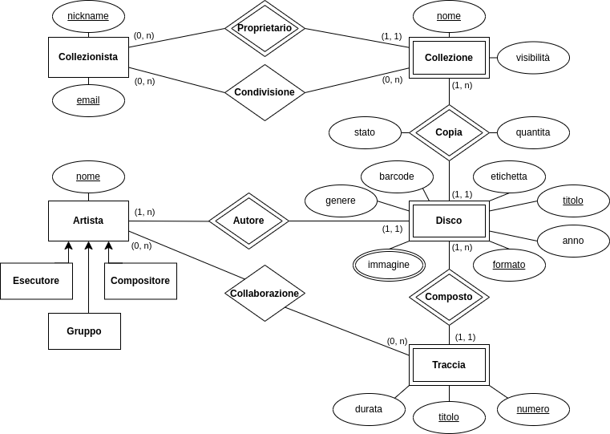

# Laboratorio di Basi di Dati:  *Progetto "Collectors"*

**Gruppo di lavoro**:

| Matricola | Nome  |             Cognome             | Contributo al progetto |
|:---------:|:-----:|:-------------------------------:|:----------------------:|
|  271744   | Marco |             Ciucci              |          100%          | 

**Data di consegna del progetto**: gg/mm/aaaa

## Analisi dei requisiti

- Vanno (eventualmente) discusse tutte le scelte progettuali relative al dominio, le ambiguità e il modo in cui sono state risolte.
- E' possibile infine inserire qui un glossario che riporta tutti gli oggetti di dominio individuati, con la loro semantica, i loro eventuali sinonimi e le loro proprietà.


- Registrazione di dati relativi ai collezionisti, alle loro collezioni di dischi (ogni collezionista può creare più collezioni). 
- Per ogni disco in una collezione, dovranno essere specificati gli autori, il titolo, l'anno di uscita, l'etichetta discografica, il genere musicale (scelto da una lista predefinita), lo stato di conservazione (scelto da una lista predefinita), il formato, il barcode, se disponibile (i codici a barre garantiscono l'identificazione univoca dell'elemento)
- Lista delle tracce, ciascuna con titolo, durata, ed compositore ed esecutore, se diverso da quelli dell'intero disco. 
- Ogni disco può essere associato a una o più immagini (copertina, retro, eventuali facciate interne o libretti, ecc.).
- Per ogni disco, il collezionista potrà inoltre indicare l'eventuale numero di doppioni a sua disposizione.
- I collezionisti possono decidere di condividere la propria collezione con specifici utenti o in maniera pubblica.

## Progettazione concettuale



- Copia (stato, quantita)
- Chiavi
- Visibilita
- Generalizzazione
- Collaborazione


- Commentate gli elementi non visibili nella figura (ad esempio il contenuto degli attributi composti) nonché le scelte/assunzioni che vi hanno portato a creare determinate strutture, se lo ritenete opportuno.

### Formalizzazione dei vincoli non esprimibili nel modello ER

- Elencate gli altri **vincoli** sui dati che avete individuato e che non possono essere espressi nel diagramma ER.

## Progettazione logica

### Ristrutturazione ed ottimizzazione del modello ER


- Tipo artista
- Info_Disco
- Immagine (path)


- Discutete le scelte effettuate, ad esempio nell'eliminare una generalizzazione o nello scindere un'entità.

### Traduzione del modello ER nel modello relazionale

* **Collezionista** (**<ins>ID</ins>**, nickname, email) <br>
* **Collezione** (**<ins>ID</ins>**, <ins>ID_collezionista</ins>, nome, visibilità) <br>
* **Condivisione** (<ins>ID_collezionista</ins>, <ins>ID_collezione</ins>) <br>
* **Artista** (**<ins>ID</ins>**, nome, tipo) <br>
* **Disco** (**<ins>ID</ins>**, <ins>ID_autore</ins>, titolo, formato, barcode) <br>
* **Copia** (<ins>ID_collezione</ins>, <ins>ID_disco</ins>, stato, quantità) <br>
* **Immagine** (**<ins>ID</ins>**, <ins>ID_disco</ins>, path, etichetta) <br>
* **Info_Disco** (<ins>ID_disco</ins>, genere, descrizione, etichetta, anno, anteprima) <br>
* **Traccia** (**<ins>ID</ins>**, <ins>ID_disco</ins>, numero, titolo, durata) <br>
* **Collaborazione** (<ins>ID_artista</ins>, <ins>ID_traccia</ins>)

|      Attributo       |   Significato   |
|:--------------------:|:---------------:|
|  **<ins>ID</ins>**   | Chiave primaria | 
| <ins>ID_entità</ins> | Chiave esterna  |

## Progettazione fisica

### Implementazione del modello relazionale

- Inserite qui lo *script SQL* con cui **creare il database** il cui modello relazionale è stato illustrato nella sezione precedente. Ricordate di includere nel codice tutti
  i vincoli che possono essere espressi nel DDL.

- Potete opzionalmente fornire anche uno script separato di popolamento (INSERT) del database su cui basare i test delle query descritte nella sezione successiva.

### Implementazione dei vincoli

- Nel caso abbiate individuato dei **vincoli ulteriori** che non sono esprimibili nel DDL, potrete usare questa sezione per discuterne l'implementazione effettiva, ad esempio riportando il codice di procedure o trigger, o dichiarando che dovranno essere implementati all'esterno del DBMS.

### Implementazione funzionalità richieste

- Riportate qui il **codice che implementa tutte le funzionalità richieste**, che si tratti di SQL o di pseudocodice o di entrambi. *Il codice di ciascuna funzionalità dovrà essere preceduto dal suo numero identificativo e dal testo della sua definizione*, come riportato nella specifica.

- Se necessario, riportate anche il codice delle procedure e/o viste di supporto.

#### Funzionalità 1

> Definizione come da specifica

```sql
CODICE
```

#### Funzionalità 2

> Definizione come da specifica

```sql
CODICE
```

## Interfaccia verso il database

- Opzionalmente, se avete deciso di realizzare anche una **(semplice) interfaccia** (a linea di comando o grafica) in un linguaggio di programmazione a voi noto (Java, PHP, ...) che manipoli il vostro database , dichiaratelo in questa sezione, elencando
  le tecnologie utilizzate e le funzionalità invocabili dall'interfaccia.

- Il relativo codice sorgente dovrà essere *allegato *alla presente relazione.

-----

**Raccomandazioni finali**

- Questo documento è un modello che spero possa esservi utile per scrivere la documentazione finale del vostro progetto di Laboratorio di Basi di Dati.

- Cercate di includere tutto il codice SQL nella documentazione, come indicato in questo modello, per facilitarne la correzione. Potete comunque allegare alla documentazione anche il *dump* del vostro database o qualsiasi altro elemento che ritenete utile ai fini della valutazione.

- Ricordate che la documentazione deve essere consegnata, anche per email, almeno *una settimana prima* della data prevista per l'appello d'esame. Eventuali eccezioni a questa regola potranno essere concordate col docente.
